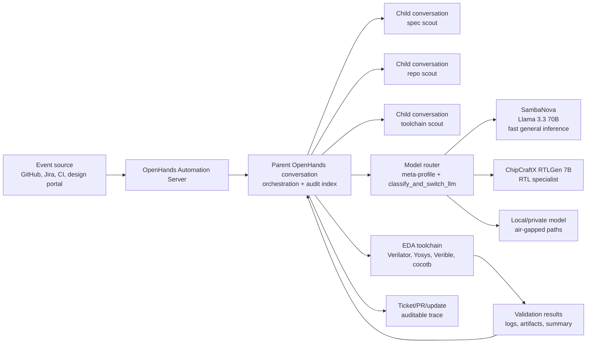

# Architecture

## System Shape

## Responsibilities

OpenHands Automation Server:

- receives event or cron trigger
- launches the workflow
- passes event context
- records run status

OpenHands Agent:

- plans the task
- creates or edits files
- invokes tools
- decides when to route to specialist models
- posts the final result

Model Router:

- selects model by task type
- respects data boundary and deployment mode
- uses latency-sensitive models for repeated loops
- uses specialist models for domain generation

EDA Toolchain:

- validates syntax, lint, simulation, synthesis, and formatting
- acts as the source of truth
- produces logs that the agent can triage

## Why This Is Different

This is not a single assistant inside an editor. It is a workflow runtime:

- model-agnostic
- toolchain-aware
- event-triggered
- policy-aware
- deployable locally, in cloud, or in an air-gapped environment
