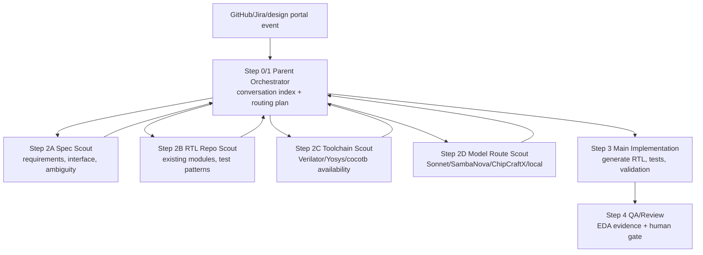

# Parent And Child Conversations

## Pattern From The SDLC Reference

The `rajshah4/sdlc-automation-github-demo` uses a visible sidekick pattern:

1. Step 0 launcher conversation unwraps the event.
2. It starts multiple bounded scout conversations.
3. It starts or hands off to the main implementation conversation.
4. The launcher prints a conversation index so the audience can click through each step.

For the semiconductor workflow, use the same shape:

> One parent agent owns orchestration and audit. Child conversations do bounded specialist work.

## Why This Matters

This is a major differentiator from IDE-first assistants.

Claude Code, Cursor, and Cline are strong interactive coding tools. OpenHands can show an enterprise workflow:

- event triggers parent orchestration
- parent launches child conversations
- child conversations use different model profiles
- parent consumes child summaries
- parent decides the next validated action
- every step leaves an auditable trace

## Proposed Foundry Sidekick Flow

## Child Conversation Roles

| Child conversation | Mode | Job | Model hint |
|---|---|---|---|
| Spec Scout | read-only | Normalize request, find ambiguity, extract acceptance tests | Sonnet or fast general |
| RTL Repo Scout | read-only | Find existing RTL/test patterns and likely files | SambaNova fast general |
| Toolchain Scout | read-only/deterministic | Identify available EDA commands and image gaps | no LLM first, then fast general |
| Model Route Scout | read-only | Recommend model route and data-boundary policy | classifier/meta-profile |
| RTL Specialist | bounded generation | Generate candidate RTL or targeted repair | ChipCraftX |
| QA/Review | evidence | Run or summarize validation and review risks | EDA tools plus Sonnet |

## Parent Contract

The parent conversation should always publish:

- event source and request ID
- child conversation links
- child outputs consumed
- model routing decisions
- files changed by the main implementation conversation
- validation commands and results
- human gate status

## Short Walkthrough Version

If time is tight, show only:

1. Parent launcher/index.
2. One child context scout.
3. One child RTL specialist or model route step.
4. Main implementation plus validation.

The audience still sees the core idea: OpenHands can coordinate multiple conversations, not just answer inside one chat.
